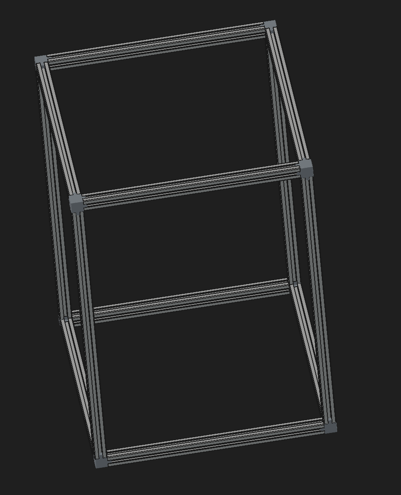
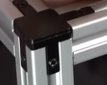
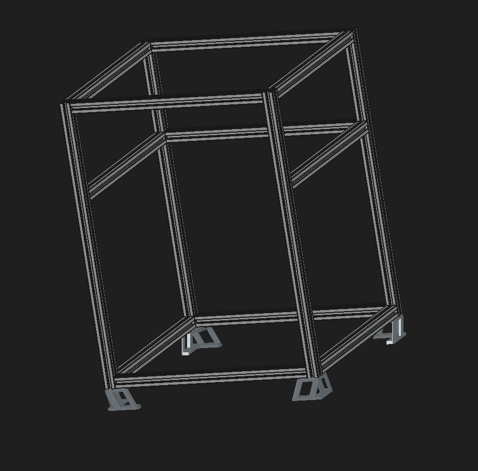

# Pandaprint - A 3D Printer from Scratch

## July 30 : Pandaprint is born (~ 3 hours)

Alright, so here we go again.

Since outpost ended recently ( I wasnt able to go :sob:) ive been waiting **2 Weeks** for the forms to reopen or stardance to work so i can get stardust and funding for my other projects.
Im slowly losing hope and complaining about it all the time isn't gonna help me, so i needed a new project or id go insane and/or spiral into depression.

Unfortunately i had no ideas.

I kept gravitating towards ANOTHER cyberdeck or dashboard thingy but i was slowly getting bored of those - then i came across the videos from outpost.
There were SO MANY 3D PRINTERS

I really wanted a 3D Printer of my own, till now ive only ever used the one from my makespace, so this is gonna be my new project - a 3D Printer of my own

The first thing i did was ask in #infill (old past Hack Club event where you would build 3d printers) and got so much help from @anicetus and @java (shoutout to them !)

I then watched 4 hours of yt videos on how 3d printers work and how to build them, the best one i found was the one from Dr D-Flo - iut was a 2 and a half hour MARATHON of a video but it was extremely informative and thorough.
After that i watched a few build videos and explored the websites for the Voron 3D Printers like the Trident and Legacy for some Inspiration

Then it came time to decide what Pandaprint will look like - the planning phase.

- I first decided i want a CoreXY design - thats where the print head only moves in 2 directions (X and Y, _DUH_) and the Print Bed (where the print is housed) moves up and down
- Then the Frame - What will it be built out of ? I decided i would stick with the traditional path and use 2020 Aluminum Extrusions - i decided i would use approximately same size printer as the Voron Trident -
  A total volume of 500 x 350 mm ( NOT THE PRINT VOLUME )
- I decided i would use linear rails for the Gantry (This is what lets the print head move - there are linear rails, which use a closed loop belt and stepper motors to move, but also linear rods, which basically very simplified spin a bolt to move the head - this is an open loop system)

As for the rest - like extruder, toolhead, motors, nozzle/hotend, etc. - Ill decide this later after asking around on Slack and researching a bit more.

I then got to working, and downloaded the 3D models of multiple similar printers and started working on the frame for my own.

For the first time i tried, i thought id use these square end caps to connect the extrusions - like this :

I didnt like the look of this that much though - this would add little corner cubes at the ends, which i did NOT want, as it just didn't look good for me

I wanted to hide the joints, so i did a bit of research and decided i would use these (or something like these) :

So i removed the connectors and just aligned the extrusions with each other.
After that, it was time to add the gantry - these are the rails that the printhead will be attached to.

I also added some feet i stole from a different 3d printer

This is the final result of today :

Tomorrow ill add the corner brackets that support the gantry (the devils in the details ! and in my damn touchpad it keeps tweaking) and hopefully the movement system for either printhead or print bed - but i have a lot of personal stuff do do ill see if i can find time.

To whoevers reading this, goodbye !
